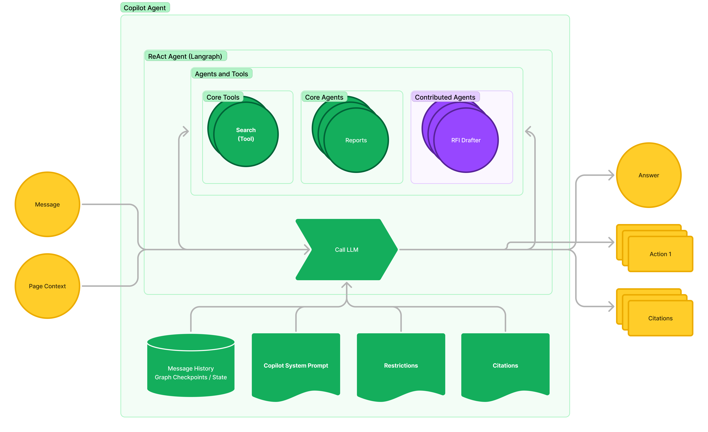

This section describes the internal flow of the [Procore Agent](./concepts.md#agent).

The main concept of Procore Agents is an Agent. An agent is an entity that can perform tasks on behalf of users with or without the help of LLMs. Agents can be used to automate tasks, provide information, or perform other functions. Agents can be used on their own as a simple LLM application, in conversational UIs, and eventually to build multi-agent autonomous systems.

Procore Agents will support different types of agents, but the initial implementation focuses on single-prompt agents that can use Tools or other Agents to perform tasks with [ReACT](https://arxiv.org/pdf/2210.03629).

## Agent Flow Overview

In the current implementation, Procore Agent is a pipeline that accepts arbitrary structured input, processes it using LLM, and outputs structured or unstructured data.

Let's break down the flow:

1. Agent receives input from the user via Agents API or Copilot Agent.
2. Based on `input_schema`, the agent validates input using JSON Schema and LLM Prompting.
3. Agent uses system prompt, agent prompt, [tools](./concepts.md#tool), and [actions](./concepts.md#actions) to construct a Langgraph Graph that implements the ReAct pattern.
4. Agent executes the graph and ensures structured output.
5. Agent extracts additional inputs, like [Actions](./concepts.md#actions).
6. Agent responds with outputs.

## Agent in Copilot Agent Flow Overview

Procore Agents platform allows exposing Agents in the Copilot SidePanel. Under the hood, this is implemented by introducing Agents into [Copilot Agent](./concepts.md#copilot-agent) via LLM Function Calling, so each Agent is dynamically represented as a function in Copilot Agent. The agent's description is used as the description of the function and therefore plays a crucial role in intent recognition; the input schema is used as the function arguments definition; the name is used as the name of the function.

1. Copilot Agent receives input from the user (e.g., from SidePanel) alongside page context if available on the page.
2. Copilot Agent creates a Langgraph Graph that implements the ReAct pattern. The graph is configured with core Tools and all applicable Agents converted to Tools.
3. Copilot Agent uses checkpoints stored in the Copilot Postgres database for message history and multiturn support.
4. Copilot Agent executes the graph, allowing multiple Tools or Agents to contribute to the response.
5. Copilot Agent extracts actions, sources, and other data from the response.
6. Copilot Agent responds with an answer.
