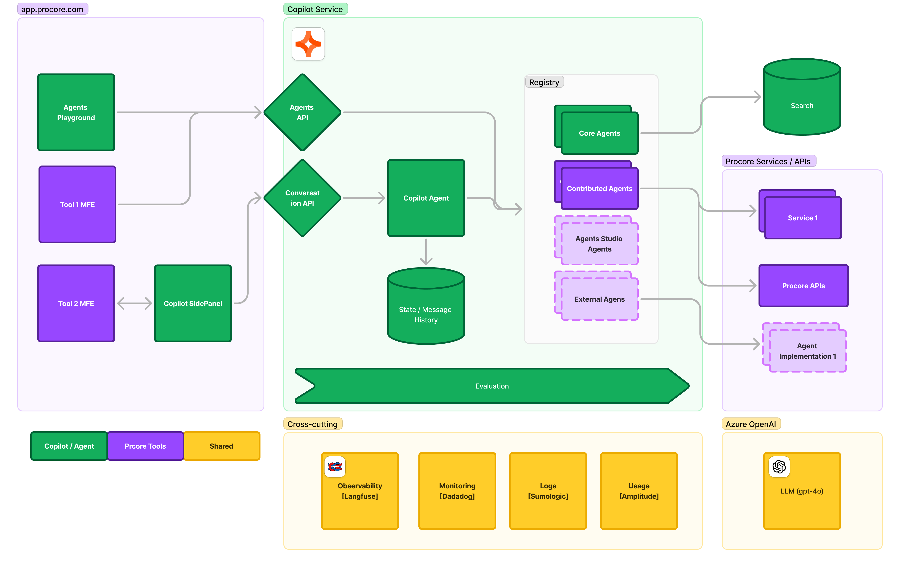

Procore Agents implement a platform to build, manage, and host AI Agents. Procore Agents are also bridges between Agents and Copilot Agent.

This document focuses on the parts of Procore Copilot that are relevant to Procore Agents.

## Overview

Procore Agents are implemented on top of Procore Copilot and inherit relevant features. On top of Copilot, the Agent Platform implements:

- Hosting of Agents, which allows running multiple types of Agents
- Implementation of [Tools](./concepts.md#tool) to allow Agents to perform different types of tasks
- Extension of [Copilot Agent](./concepts.md#copilot-agent) to support Agents in the Copilot SidePanel
- Exposure of Agent APIs to allow execution of Agents, and in the future, these APIs will allow management of Agents
- Agents Playground - UI intended for developers of Agents. In the future, we plan to extend it to allow management of Agents

### Key highlights

- Agents are hosted in the Procore Copilot service
- Agents run on top of Azure OpenAI PTU instances
- LLM Observability is implemented via Langfuse
- Service Observability uses Datadog, Sumologic, and other Procore tools
