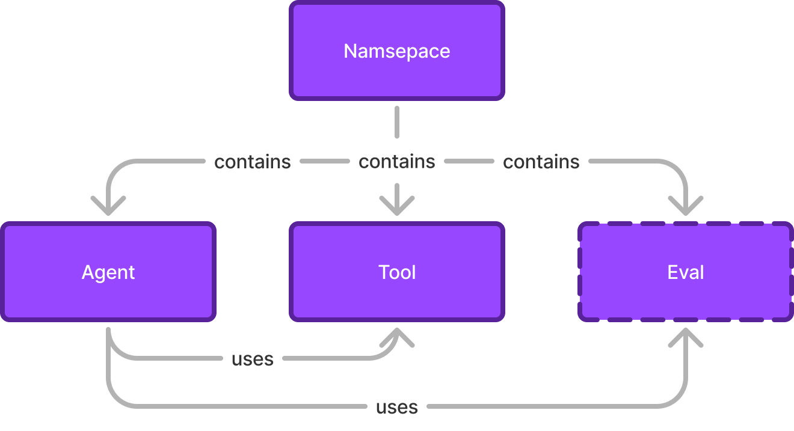

## Agent

The main concept of Procore Agents is an Agent. An agent is an entity that can perform tasks on behalf of users with or without the help of LLMs. Agents can be used to automate tasks, provide information, or perform other functions. Agents can be used on their own as a simple LLM application, in conversational UIs, and eventually to build multi-agent autonomous systems.

Procore Agents will support different types of agents, but the initial implementation focuses on single-prompt agents that can use Tools or other Agents to perform tasks with [ReACT](https://arxiv.org/pdf/2210.03629).

For technical details on how Agents work, please see [Agent](./agent.md).

See also:
- [Langchain Agents](https://python.langchain.com/docs/concepts/#agents) - used under the hood
- [AWS Bedrock Agents](https://aws.amazon.com/bedrock/agents/) - conceptually similar to Procore Agents
- [Microsoft AutoGen](https://github.com/microsoft/autogen) - also conceptually similar to Procore Agents
- [Langgraph](https://langchain-ai.github.io/langgraph/concepts/)
- [ReACT: Synergizing Reasoning And Acting In Language Models](https://arxiv.org/pdf/2210.03629)
- [Generative Agents: Interactive Simulacra of Human Behavior](https://arxiv.org/abs/2304.03442)
- [CrewAI](https://www.crewai.com/open-source) - ideas on multi-agent systems

## Prompt

A LLM prompt is a carefully designed text that guides a large language model (LLM) used in Agent to generate a specific and relevant response. It serves as the “instructions” for the LLM to interpret and process.

Key Elements of a Well-Crafted Prompt

1.	Clarity: The prompt should clearly define the task or question, avoiding ambiguity.
2.	Context: Providing sufficient background or contextual information ensures the LLM understands the purpose.
3.	Specificity: Directly stating what is expected in the output reduces the likelihood of irrelevant or incomplete responses.
4.	Structure: Using a logical format, such as bullet points or numbered steps, can help the LLM respond in an organized way.
5.	Constraints: If necessary, the prompt can include specific rules or limitations (e.g., “Limit your response to 200 words” or “Answer in JSON format”).

See also:
- [OpenAI Prompt engineering](https://platform.openai.com/docs/guides/prompt-engineering/prompt-engineering)

## Tool

Tool is our abstraction for function calling. Under the hood it uses [Langchain Tool](https://python.langchain.com/docs/concepts/#tools). Conceptually tools, or functions, are the contract that helps LLMs to call external functionality. Main examples are: retrievers to get external data, contexts to get external data into prompt, actions that can perform modifications in data, etc. Some Tools are implemented inside `copilot-service`, and some of them are delegating execution to external services. As a general rule, tools should be fast (under 1 second).

An example of a Tool is `search/relevant_project_documents`, which is a wrapper to call Procore Search Retrieve API. It allows Agents to get relevant documents for the given user based on semantic search for neutral language input. So for example, if an Agent needs to find documents related to "lightning protection" it can call this Tool and get the list of documents.

See also:
- [Langchain Tools](https://python.langchain.com/docs/concepts/#tools) is what we use under the hood
- [Tools in Agents](tools.md) - how to create and use existing tools in Agents

## Action

**Action** is a term used when an agent declares a way for user to continue interaction with the system. Actions can be interactive UI elements, such as buttons, or non-interactive UI actions that are automatically processed by the system itself. 

### Interactive Actions:
For example, if an user submits a request to create a draft RFI, the agent returns these draft values to the user in the SidePanel along with an integration event that appears as an "Apply to RFI" button. If the user is satisfied with the provided values, he can click the button, and these values will populate the corresponding form on the "Create RFI" page.

### Non-Interactive Actions:
Non-interactive actions occur without additional user involvment. A good example of such an action is when a user triggers the agent with a request to change the duration of a construction task from 10 days to 15. This action does not require any additional confirmations and simply calls the necessary system functions to execute the requested action.

See also:
- [Actions ADR](https://github.com/procore/copilot/blob/main/docs/adrs/0009-actions-from-copilot.md)

## Declarative Agent

To simplify contribution and management of the Agents, Procore Agents introduce a declarative format for Agents. This format is a YAML file that describes one or more Agents, its prompts, the tools it uses, routing information and evaluations. The declarative format is a way to define the Agent without writing code. It is a way to define the Agent in a human and machine readable format.

Please check [Schema](./schema.md) for format details.

## Declarative Tools

Declarative Tools are a way to define Tools in a declarative format and reduced the complexity of the codebase.

Please check the next documents for more details:
- [Declarative Tools Implementation Guide](advanced/declarative_tools_implementation_guide.md)
- [Declarative Procore API Tool](declarative_tools/procore_api_tool.md)

### Available Declarative Tools
- [procore_api_tool.md](../declarative_tools/procore_api_tool.md): A tool that interacts with the Procore API

## Namespace

Namespace is a way to group Agents, Tools, and other entities in Procore Agents implementation. It is a way to organize the codebase and the declarative format. In most cases it also defines team ownership, so for example `rfis` namespace is owned by the RFI team. However we will also maintain couple of other namespaces like `core` for some shared functionality, `search` for search related tools, `support` for access to support pages. And of course, [`examples`](../../services//copilot/contrib/examples) where we will keep examples of the Agents.

## Copilot Agent

Copilot Agent aka Conversation Model aka Conversation Chain, is a model that used by Copilot to orchestrate chat-like interface. It used to improve Search experience (Search field in Procore App) and runs behind Copilot SidePanel. Copilot Agent can use Procore Agents, to perform specific tasks.

Copilot Agent is exposed at `/rest/v1.0/copilot/conversation` APIs

## Observability

Observability helps to debug, monitor, and understand the behavior of the Agents. Procore Agents provides a way to observe the behavior of the Agents via Langfuse, Datadog and Sumologic.