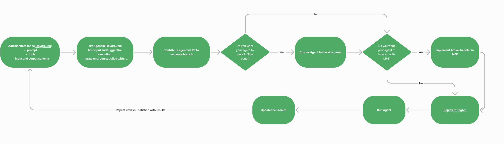

# How to create an Agent

To create an Agent you will need to follow the instruction according to the flow

## Step 1: Add Manifest to the [Playground](https://app.procore.com/webclients/host/companies/6155/projects/208072/tools/copilot/playground)

This step involves defining the agent's purpose, inputs, outputs, and any tools it needs for proper functionality. The manifest acts as the blueprint for the agent, outlining its behavior and ensuring it can interact correctly with the environment.

### **A. Define the Agent's Purpose**

- Clearly describe what the agent is designed to do. This helps to understand the agent's scope and functionality.
- For example, state whether the agent generates jokes, processes data, or provides recommendations.

### **B. Specify Input Schema**

- Outline the format and requirements for the data the agent expects. The input schema should include:
  - A description explaining the input's purpose.
  - Properties that detail the specific data fields the agent needs, such as strings, numbers, or objects.
  - A title that organizes the schema.
  - Add descrition for each field

### **C. Specify Output Schema**

- Define the format of the agent’s response. The output schema should include:
  - A description explaining the structure of the agent’s response.
  - Properties that describe the specific data fields the agent will return.
  - A title for the schema to ensure clarity.
  - Add descrition for each field

### **D. [Write the Prompt](https://github.com/procore/copilot/blob/main/docs/agents/concepts.md#prompt)** 

- Draft a prompt that guides the agent’s behavior. The prompt should specify how the agent processes input and produces output. Dynamic placeholders can be used to make the prompt adaptable to various inputs.
- [Some tips](https://platform.openai.com/docs/guides/prompt-engineering/prompt-engineering)

### **E. Provide a Name for the Agent**

- Assign a unique name to the agent that reflects its purpose. This name is essential for distinguishing it from other agents in the system.

### **F. [Add Tools](https://github.com/procore/copilot/blob/main/docs/agents/tools.md#tools-in-agents)** 

- If the agent requires additional functionalities or you need to get some extra data, include tools that can help it perform specific tasks. 
Based on the flowchart provided, here are the step-by-step instructions:

## Step 2: Test Agent in the Playground

- Add the necessary input in the Playground and trigger the agent's execution.
- Observe the results and make adjustments to the agent as necessary.

## Step 3: [Contribute Agent via Pull Request (PR)](https://github.com/procore/copilot/blob/main/docs/agents/contribution.md#agents-contribution-guide)

- Once satisfied with the agent's performance, contribute it to a separate branch in your code repository via a PR.

## Step 4: Decide If You Want the Agent to Work in the Side Panel

- If **Yes**:
### Expose the agent to the side panel.
  - To do this, you need to update your agent's manifest by adding `enable_in_conversation: true` line in the agent's root config section. Please keep in mind that names of agents included into conversation should be unique, so feel free to learn how existing agents are named and how they work so that you won't define the agent which performs already described and implemented use-cases.
  - Before doing this, please ensure that your agent's description in manifest is self-descriptive, clear and non ambiguous. Also please check other contributed agent's descriptions to be sure you won't interfere with already exposed agents and their descriptions.
  - Once you've changed your manifest to include described agent into conversation, you can deploy your changes to the Tugboat, open sidepanel and try to invoke your agent be messaging your specific use-case.
  - Keep in mind that you can also include custom tools to your agent, add interactive (it will draw button which emits event calling specific system action) and non-interactive (it will execute described routine seamlessly) actions to your agent conversation.
- If **No**, proceed to the next step.

## Step 5: Decide If You Want the Agent to Interact with Micro-Frontend (MFE)

- If **Yes**:
  - [Implement an action handler in MFE to facilitate interaction for conversational flow](https://github.com/procore/copilot/blob/452ad9e7cdd82745bb6ee1f9ccc053410b674e98/docs/agents/tutorials/implement_agent_actions.md)
  - [Direct Agent API call via Procore UI](https://github.com/procore/copilot/blob/452ad9e7cdd82745bb6ee1f9ccc053410b674e98/docs/agents/tutorials/use_agent_via_ui.md#direct-agent-api-call-via-procore-ui)
- If **No**:
  - Directly proceed to deploy.

## Step 6: [Deploy the Agent](https://procoretech.atlassian.net/wiki/spaces/CSE/pages/1963294835/Create+a+Shipment+with+Tugboat)

- Deploy the agent to **Tagbot** or your chosen deployment platform.
- [How to raise Tagboat shipment - Monoloth with Copilot](https://procoretech.atlassian.net/wiki/spaces/PCD/pages/2927951935/How+to+Spin+up+a+Tugboat+Instance+of+Monoloith+with+Copilot)

## Step 7: [Run the Agent](https://github.com/procore/copilot/blob/main/docs/agents/tutorials/use_agent_via_api.md#agents-api)

- Test the deployed agent on the **Tagbot** 

## Step 8: Iterate if Necessary

- If the results are not satisfactory, revisit the Playground and update the prompt or make necessary modifications.
- Repeat the process until the agent meets expectations.

This process ensures a streamlined development, testing, and deployment cycle for agents.

