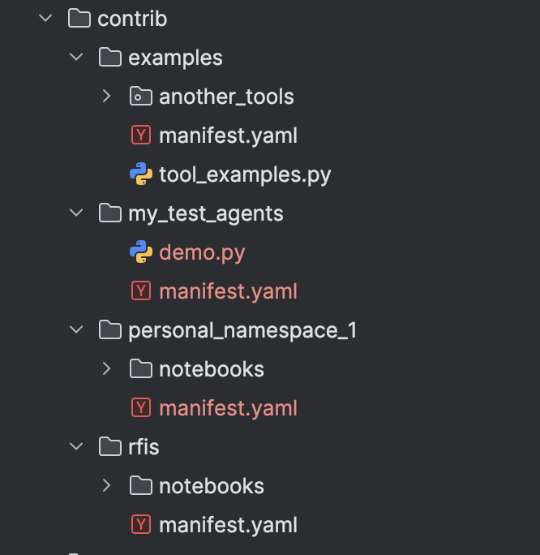
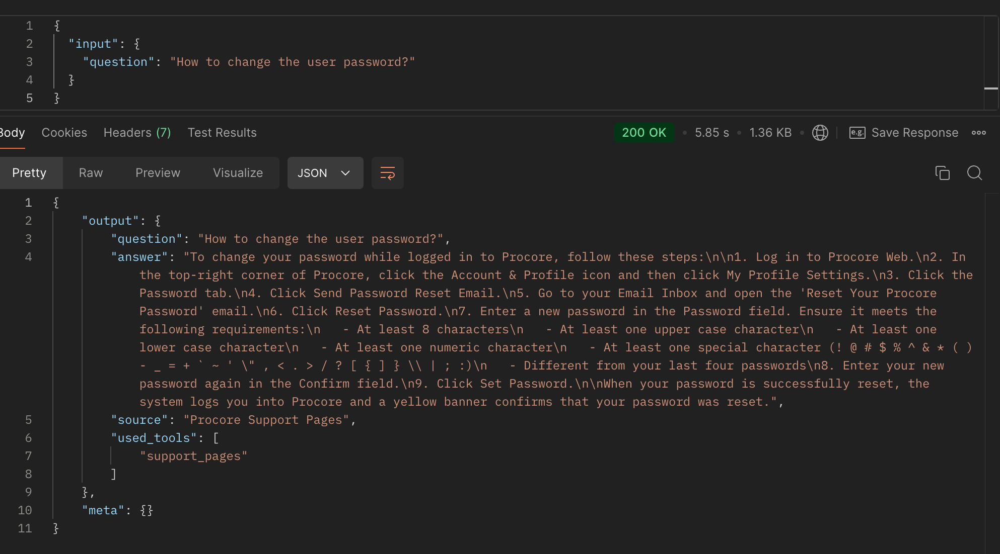
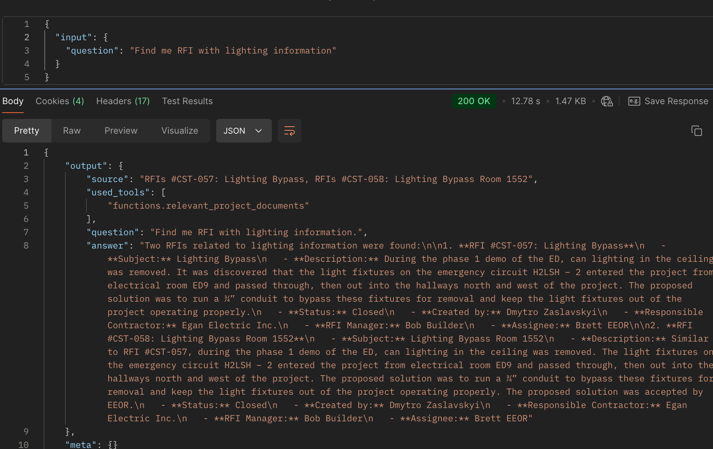
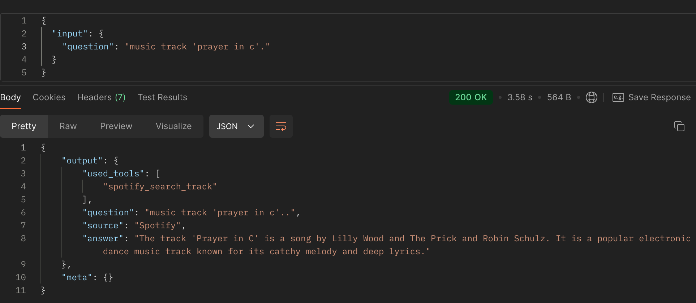
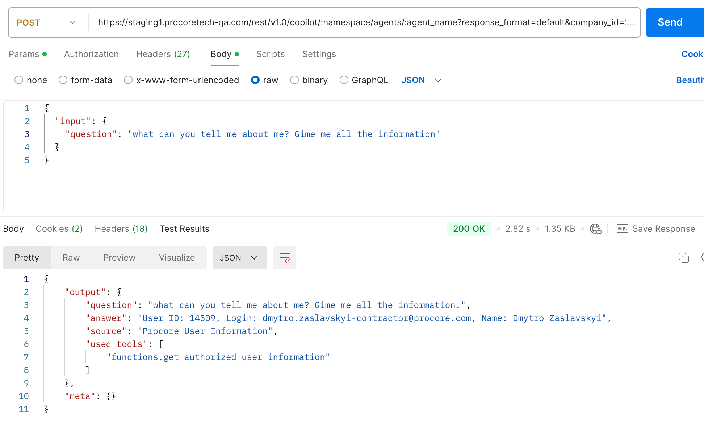

This document outlines the common concepts of tools in the Copilot Agent and provides guidelines on how to create and use them effectively. In the context of Copilot Agent, a tool is analogous to a function in programming. It serves as a contract that enables LLMs (Large Language Models) to interact with external functionality.

For practical examples on how to create and use tools within Copilot Agent, refer to the `examples` namespace found here: [services/copilot/contrib/examples](../../services/copilot/contrib/examples).

## Types of Tools

There are several types of tools available in the Copilot Agent:
1. [Declarative Tools](#declarative-tools)
2. [Contribution (Contrib) Tools](#contribution-contrib-tools)
3. [Built-in Tools](#built-in-tools)

## Available Declarative Tools

1. [Procore API Tool](declarative_tools/procore_api_tool.md) - A tool that interacts with the Procore API.


### Declarative Tools

Declarative tools allow you to define tools using a declarative format in YAML. This approach simplifies the creation and management of tools by providing a human-readable format, reducing the amount of code required.

Each declarative tool is defined with its own unique YAML configuration and includes a few common fields:
- `name` - The name of the tool.
- `description` - A detailed description of the tool (similar to a docstring for contributed tools).
- `type` - The type of tool, used to determine its implementation.

You can also specify additional common fields for declarative tools. A complete list of these fields can be found in the [LangChain BaseTool documentation](https://api.python.langchain.com/en/latest/core/tools/langchain_core.tools.base.BaseTool.html).

Declarative tool definitions should be placed in the `tools_definitions` section at the same level as the `agents` section within the manifest.yaml file.
This section is optional and can be omitted if no declarative tools are required.

**Example**
> Below is an example of where and how declarative tools should be defined:
```yaml
name: examples
name_for_human: Examples
metadata: {}

# Declarative tools definitions
tools_definitions:
 - name: my_tool_name
   description: My tool description that will used by the agent.
   type: <declarative_tool_type>  # procore_api
   ... # <-- other unique fields based on the tool type

# Regular agents definitions
agents:
- name: ...
  description: ...
```

Currently, only one type of declarative tool is supported, but you can implement your own tool type by creating a new class to handle the tool’s functionality. 
Follow this tutorial [declarative_tools_implementation.md](../declarative_tools/declarative_tools_implementation.md) to create your own declarative tool type.

#### Declarative Tools Types

1. `procore_api` - Procore API tool allows you to interact with the Procore API endpoints without writing python boilerplate code. More details about the Procore API can be found [procore_api_tool.md](declarative_tools/procore_api_tool.md).


#### Advanced
To create your own Declarative Tool Type see this tutorial [declarative_tools_implementation_guide.md](advanced/declarative_tools_implementation_guide.md).

---

### Contribution (Contrib) Tools

Tools implemented in the `services/copilot/contrib/<your_contrib_dir_name>/` directories are referred to as **contrib** tools. It is recommended to name the folder based on the system or Procore tool it applies to. The `manifest.yaml` file’s `name` field will create a namespace that identifies the tool within your `contrib/<your_contrib_dir_name>/` directory.
Example of how it look like:


#### Create New Contributed Tool

Creating a new Copilot Agent **contrib tool** follows the same process as creating a regular LangChain tool ([LangChain/LangGraph Tool](https://langchain-ai.github.io/langgraph/#example)). To create a new `contrib` tool that can be used in Copilot Agents, use `@copilot_agent_tool()` instead of `@tool` from LangChain.

#### Docstring Structure for LangChain Tools
When writing docstrings for LangChain tools, follow the **Google style** format. The structure should include:

1. Brief Description: Start with a brief, clear explanation of the tool's purpose.
2. Parameters (Args): List and describe each parameter the tool accepts.
3. Returns: Explain what the tool returns.
4. Examples (optional): Provide one or more usage examples.

```python
from copilot.agents.tools.decorators import copilot_agent_tool

@copilot_agent_tool()
def example_tool(param1: str, param2: int) -> str:
    """
    Brief description of what the tool does.

    Args:
        param1 (str): Description of param1's purpose.
        param2 (int): Explanation of param2's use.

    Returns:
        str: Description of the return value.

    Example:
        >>> result = example_tool("example", 42)
        >>> print(result)
        "Output based on example and 42"
    """
    # Tool implementation here
```

---
**Good Examples**

```python
from typing import Any

import requests
from copilot.agents.tools.decorators import copilot_agent_tool

@copilot_agent_tool() # tool name will be the same as the function name
def good_tool_1(name: str, last_name: str) -> str:
  """
  This tool is designed to concatenate person's name and last name and return the full name.
  Use this tool to get the full name of the person.

  Args:
      name (str): The first name of the person.
      last_name (str): The last name of the person.

  Returns:
      str: The full name of the person.
  """
  full_name = f"{name} {last_name}"  
  return full_name


@copilot_agent_tool("get_ld_flag_data") # tool name will be "get_ld_flag_data". 
def good_tool_2(ld_flag: str) -> dict[str, Any]:
  """
  This tool is designed to pull data from the Launch Darkly feature flag based on the provided flag name.
  Use this tool to get the data from the Launch Darkly feature flag.

  Args:
      ld_flag (str): The name of the Launch Darkly feature flag.

  Returns:
      dict[str, Any]: The data from the Launch Darkly feature flag.
  """
  response = requests.get(f"https://app.launchdarkly.com/api/v2/flags/{ld_flag}")
  # custom logic here ...
  result = response.json()
  return result
```

---
**Bad Examples**

```python
# The tools won't be available in Copilot Agents if they are declared like below

from typing import Any

import requests
from langchain_core.tools import tool
from copilot.agents.tools.decorators import copilot_agent_tool

@copilot_agent_tool # '()' <- missing brackets. The '()' is required to declare the tool correctly. The docstring does not match langchain format.
def bad_tool_1(name: str, last_name: int) -> str:
  """
  This tool is designed to concatenate person's name and last name and return the full name.
  Use this tool to get the full name of the person.
  """
  full_name = f"{name} {last_name}"  
  return full_name


@copilot_agent_tool()
def bad_tool_2(ld_flag: str) -> dict[str, Any]:
  # The docstring is missing. 
  # The docstring is required to describe the tool.  
  
  response = requests.get(f"https://app.launchdarkly.com/api/v2/flags/{ld_flag}")
  # custom logic here ...
  result = response.json()
  return result

@tool # The tool won't be available in Copilot Agents if it's not declared with '@copilot_agent_tool()' annotation.
def bad_tool_3(text: str) -> str:
  """
  This tool is designed to reverse the text.
  Use this tool to reverse the text.
  Example: "Hello" -> "olleH"
  """
  return text[::-1]
```

---
Follow these examples to better understand how tools should be created:

- **Spotify Dummy Tools**: [services/copilot/contrib/examples/another_tools/spotify_tools.py](../../services/copilot/contrib/examples/another_tools/spotify_tools.py)
- **Sync text reverser with async PDF reader tools**: [services/copilot/services/contrib/examples/tool_examples.py](../../services/copilot/contrib/examples/tool_examples.py)
---

### Built-in Tools

Tools that are implemented within the `services/copilot/plugins` directory by the `Copilot Core` team are referred to as **built-in** tools.

#### Available Built-in Tools

- `search/relevant_project_documents`
  - **Description**: the tool is designed to answer questions specifically based on the documentation such as requests for information (RFIs), submittals, specifications of a construction project. It sifts through project documents to provide answers to questions related to the project, ensuring that the information provided is directly extracted from the project documentation.
  - **Requires authorized user:** True - the tool uses `passport` to authenticate the user on the `Search Query Service` side as well as the permissions to get available documents.
  - **Example:**
    - What are the details for the HVAC submittal?
    - What is the status of RFI 123?
    - What are the installation instructions for the light fixture?
    - Find the RFI that contains information about B1 Basement.

- `support/support_pages`
  - **Description**: the tool is designed to answer questions by referencing to Procore support pages, not the project documentation. It finds answers from support resources, ensuring answers are directly sourced from support content. Topics that are covered by this plugin include everything that can be found on [Procore FAQ Page](https://support.procore.com/Sandbox/zDoc_Team/Tie/Tutorials_and_FAQs_sitemaps/faq_and_tutorials_refined).
  - **Requires authorized user:** False
  - **Optional parameters**
    - item_type: string - additional parameter which might increase search precision
  - **Examples:**  
    - How do I create an RFI?
    - What is an RFI?
    - What is an action plan?
    - How do I change my password?

---

### Attaching Tools to Your Agent

To attach tools to your agent, you need to add them to the `tools` list in the `manifest.yaml` file and specify the tool in the following format: `<namespace>/<tool_name>`.

Where:

- `<namespace>` - the value of the `name` field in the `manifest.yaml` file, which is located in the same directory as the Python module containing `<tool_name>`.
- `<tool_name>` - the name of the tool function in the Python module or the first parameter in the `@copilot_agent_tool` decorator.
- `<config>` - optional tool config, if you want your tool to have some additional values to be added to runtime you could define this section, it should be added as a key:value pair

#### Using Built-in, Contrib and Declarative Tools

There is no difference in how you use built-in, contrib or declarative tools. You can utilize them in the same way.

For example we have such `manifest.yaml` file:

```yaml
name: my_namespace
name_for_human: My Namespace
metadata: { }

tools_definitions:
  - name: auth_me_tool
    description: Tool for providing information about the user who send request to the agent.
    type: procore_api
    openapi:
      spec: reduced-openapi.json
      selector:
        path: /rest/v2.0/auth/me
        method: get

agents:
  - name: my_agent_name
    enable_in_conversation: false
    type: prompt
    description: Dummy example just to show how tools can be attached to the agent.
    prompt: |
      Question: {topic}
    
    # Attach tools to the agent
    tools:
      # builtin tool from 'search' and 'support' plugins
      - name: search/relevant_project_documents
        config:
          item_type: rfi # this will be added to tool config as {"item_type": "rfi"} which than could be used during tool call
      - support/support_pages
      
      # contrib tool from the same 'my_namespace' namespace
      - my_namespace/my_example_tool  
      
      # contrib tool from another 'ld_team' and `examples` namespaces
      - ld_team/get_ld_flag_data
      - examples/spotify_search_track
      
      # declarative tool from the same 'my_namespace' namespace
      - my_namespace/auth_me_tool
      
      # declarative tool from the same 'ld_team' namespace
      - ld_team/other_declared_tool_sample
```

Follow this `examples` [manifest.yaml](../../services/copilot/contrib/examples/manifest.yaml) to get a real example how to attach tools to your agent.

## FAQ

### Is there an example with tools?

Yes, you can refer to the [services/copilot/contrib/examples](../../services/copilot/contrib/examples) directory to understand how to create and use tools in Copilot Agent.

The example includes the following:

1. Attaching built-in and contrib tools to the agent in the `manifest.yaml` file.
2. Creating contrib tools in Python modules:
   - [spotify_tools.py](../../services/copilot/contrib/examples/another_tools/spotify_tools.py) – Spotify Dummy Tools. These tools demonstrate how to use an external API to fetch data.
   - [procore_simple_tools.py](../../services/copilot/contrib/examples/another_tools/procore_simple_tools.py) – Procore Tool. This tool uses the real Procore API to retrieve information about the user who invoked the agent.
   - [tool_examples.py](../../services/copilot/contrib/examples/tool_examples.py) – Sync tool for reversing text.
   - [tool_examples.py](../../services/copilot/contrib/examples/tool_examples.py) – Async tool for reading PDFs. This example shows how to download a PDF file, embed it, and perform a similarity search to find the most relevant documents based on the input.

### How to Test the Tools?

You can follow this tutorial to test the tools in Copilot Agent: [use_agent_via_api.md](tutorials/use_agent_via_api.md).  
The tutorial primarily focuses on using Postman, but you are not limited to just Postman. You can use any tool that allows you to send HTTP requests.

### Where can I find specification for the declarative tools?

You can find the specification for the declarative tools in the [declarative_tools](declarative_tools) directory.

### Can I create my own declarative tool type?

Yes, you can. Here is a tutorial on how to create your own declarative tool type: [declarative_tools_implementation.md](../declarative_tools/declarative_tools_implementation.md).

### Can I call a specific tool of the agent via API?

The current implementation **does not** support direct execution of a specific agent tool.

It is the developer's responsibility to structure the tool's description in a way that allows the agent to call the specific tool based on user input.
> **Note:** Agent tools are executed only in the context of agent execution.

For reference, see the [services/copilot/contrib/examples](../../services/copilot/contrib/examples/manifest.yaml) namespace, which contains the `doc_assistant_agent` with more than 4 tools. Based on the agent's prompt and tool description, the agent will select the appropriate tool to execute based on user input.

For examples:

- `Calling suppor/support_pages tool`


---

- `Calling search/relevant_project_documents tool`


---

- `Calling examples/spotify_search_track tool`


---

- `Calling examples/get_authorized_user_information tool`

