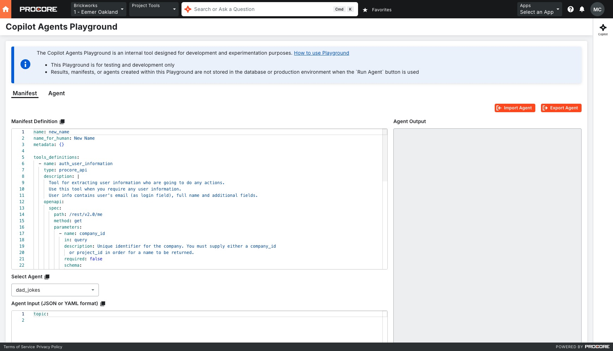
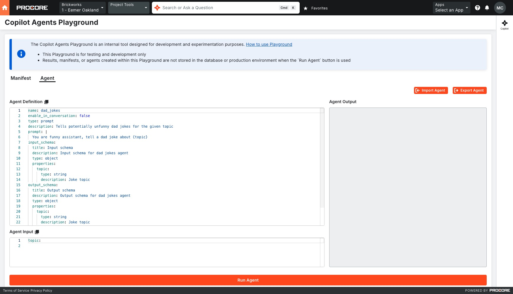

## Introduction

As a way to run and test the Agent we can use Procore UI page `/webclients/host/companies/company_id/projects/project_id/tools/copilot/playground`

`Manifest Tab` is designed for [Agents Manifest Definition](https://github.com/procore/copilot/blob/1f46dc0ed21e17f5e6268bbd2bc9006eccdd7c85/docs/agents/schema.md) testing, including provided number of Agents and Tools. `Agent Tab` can be useful if there's a need to run and test one specific Agent. Changes on each Tab do not affect other Tab.

After each Tab select, provided data will be reset to predefined values.

### How to work with Manifest Tab

On `Manifest Tab` we can find next components:

1. [Manifest Definition](https://github.com/procore/copilot/blob/1f46dc0ed21e17f5e6268bbd2bc9006eccdd7c85/docs/agents/schema.md) - definition of the Manifest including Agents and tools;

2. Select Agent - selection of provided in the definition Agents;

3. Agent Input - input structure, supports YAML and JSON formats;

4. Agent Output - response of the triggered Agent;

5. Run Agent - button that will run the selected Agent with provided input (if the Agent uses some numbers of tools response might not return quickly);

6. Import Agent - button that will import the Agent definition from local file;

7. Export Agent - button that allows to export the Agent definition to local YAML file.

### How to work with Agent Tab

On `Agent Tab` we can find next components:

1. Agent Definition - definition of the Agent;

2. Agent Input - input structure, supports YAML and JSON formats;

3. Agent Output - response of the triggered Agent;

4. Run Agent - button that will run the Agent with provided input;

5. Import Agent - button that will import the Agent definition from local file;

6. Export Agent - button that allows to export the Agent definition to local YAML file.
