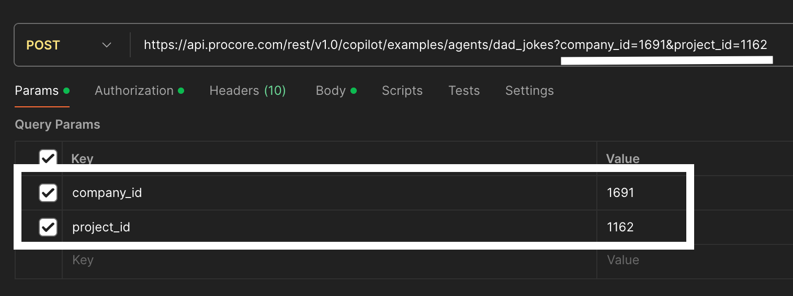

Copilot Service provides Agents API which could be used by any other services.

## Requirements

To be able to call Agents API properly make sure you have checked REST API [references](https://developers.procore.com/reference/rest/agents?version=1.0). To see that documentation you need to log in with procore credentials.

### Namespace

To organize different agents by their purposes we are using - namespaces. More about that [here](https://github.com/procore/copilot/blob/main/docs/agents/concepts.md#namespace)

### Agent name

Agents are separated by namespaces and each of them could have one or more specific agents. [Contrib](/services/copilot/contrib) directory is the place where we are storing agents by their namespaces. Agent names could be found into `manifest.yaml`. Such file exists for each namespace.

### Inputs

Generic input for a specific agent to be used for its operations. Each agent could have its own input and output schemas. For now, we have contract for inputs:

```python
{
  "input": dict | str, # defined into `manifest.yaml` file into `input_schema` field for each agent
  "meta": dict # generic field, not in use for now
}
```

This also could be found as `AgentInputSchema` into [schemas](https://github.com/procore/copilot/blob/main/services/copilot/controllers/schemas.py) file. Keep in mind that it's not a final version, and it might be changed in the future.

### User context

To be able to verify and authenticate users we are using `company_id`, `project_id`

## Call Agents API

To be able to call Agents API you need:

- Application:
  - login to [developers portal](https://developers.procore.com/) with your Procore credentials. You will receive an email so don't forget to verify
  - create an app
  - click on a new app and navigate to `OAuth Credentials` section
  - copy your `client_id` and `client_secret` from `Production OAuth Credentials`
  - update `Redirect URI` field with new value

  ```
  https://oauth.pstmn.io/v1/callback
  ```

  - more on that [here](https://developers.procore.com/documentation/oauth-keys).
- Get your Bearer token:
  - use Postman OAuth 2.0 authorization process to get it. It's very important to check all red boxes and make sure you have exact same values there otherwise it will not work, so check 
  - click on `Get New Access Token` 
  - you will be redirected to your browser and since you already loggen in, you will redirected back to postman where will see 
  - click `Proceed` to store your token
- After those steps done, add generated token to your headers, and you would be able to call Agents APIs
- Urls for quick copy:

```
https://login.procore.com/oauth/authorize
```

```
https://login.procore.com/oauth/token
```

This process will generate correct `user_id` into Bearer token and makes you able to get all necessary info.

## Example

Here is the example how to call `dad_jokes` agent from `examples` namespace:

- update url with namespace and agent_name values

- add `company_id`, `project_id` to requests `Params`. They could be dummy but cannot be empty!

- make sure you have added Bearer token to request

- update request body according to the `dad_jokes` agent input schema

- press `Send` and wait for response


## Using with Tugboat

Assuming that you are already familiar with [TugBoat Guide](https://procoretech.atlassian.net/wiki/spaces/CSE/pages/1963294835/Create+a+Shipment+with+Tugboat)

To be able to use Copilot service you need to enable (toggle ON) it during shipment creation


By default, it will use `main` branch, but you could use specific branches as well.

Same approach with local calls could be used for Tugboat builds, make sure you are using correct url for that.
