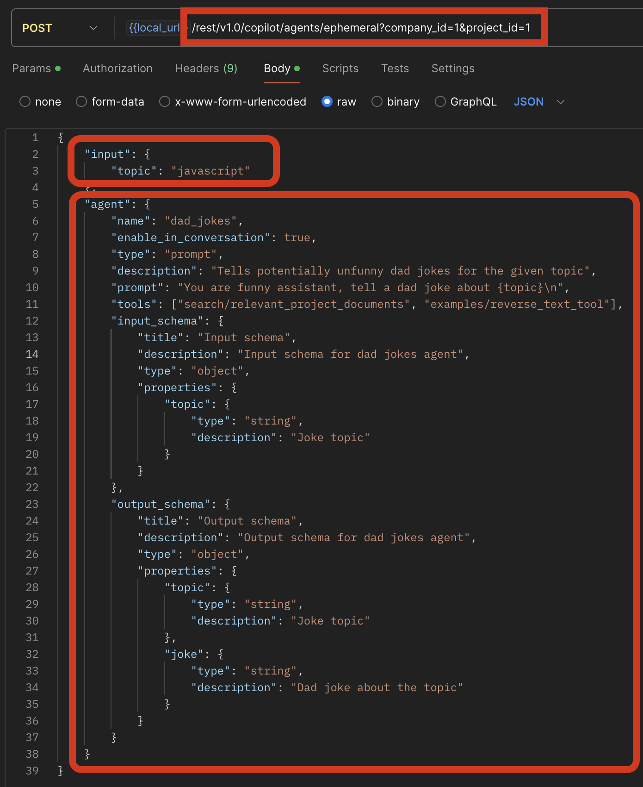
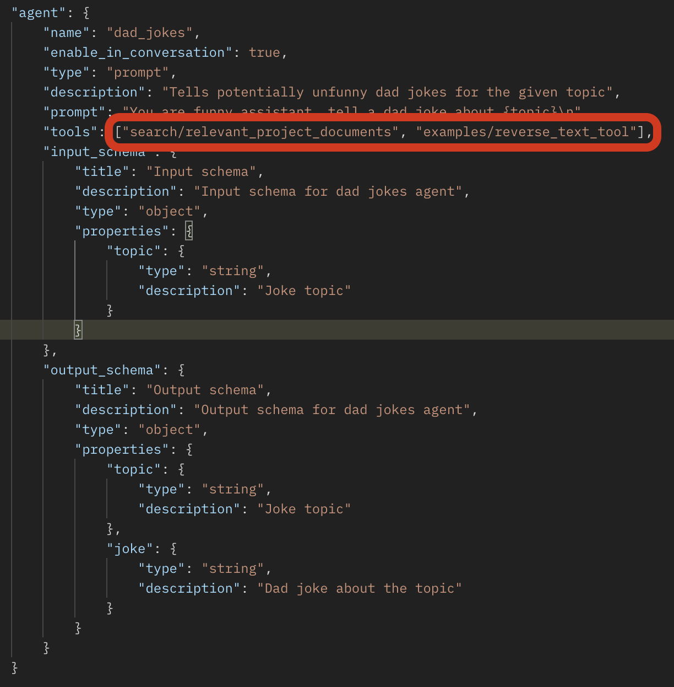
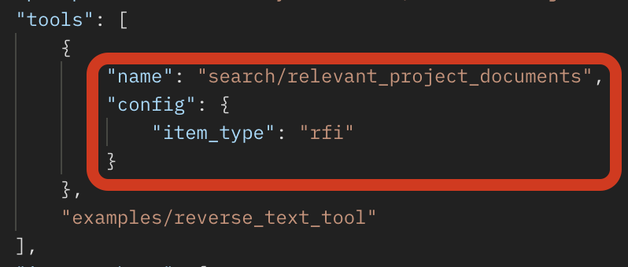
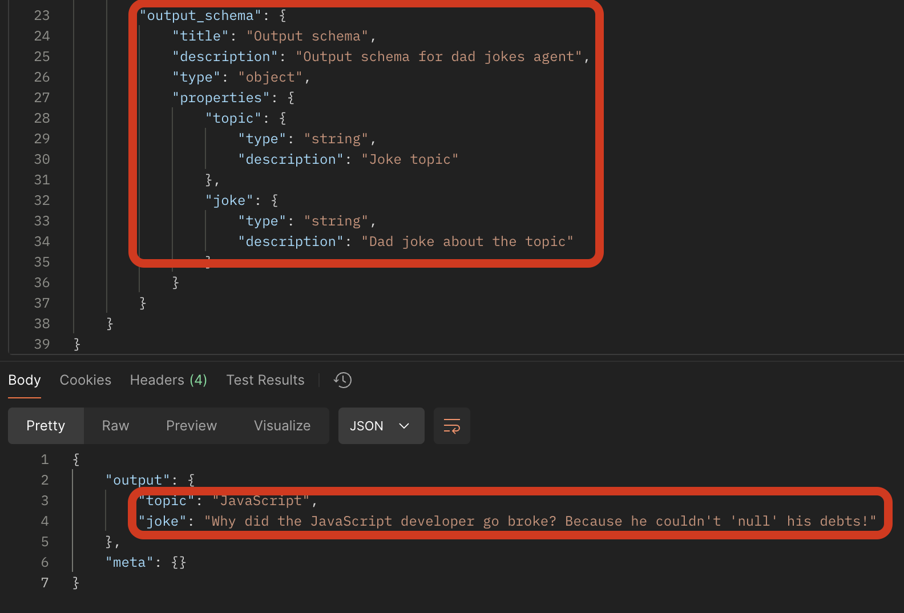

## Introduction

To enable on-the-fly testing of the changes to the agent, we have exposed a new endpoint called `ephemeral`. This endpoint allows you to update and execute the agent and its input without needing to contribute the `manifest.yaml` file or deploy the agent repeatedly.

## The endpoint and payload

### Endpoint

We have an API [documentation](https://developers.procore.com/reference/rest/agents?version=latest#execute-ephemeral-agent) for this agent where you can find all required information.

### Authentication

To authenticate and verify the user we are using OAuth2.0 flow as described [here](https://developers.procore.com/reference/rest/authentication?version=latest). Aslo authentication process with Postman could be found [here](use_agent_via_api.md) into Call Agent APIs section

### Payload

The payload consist of two fields - `"input"` and `"agent"`.

`Input` - data (an object) that agent will use as incoming data to perform its actions.  
`Agent` - agent definition in a JSON format. We are validating agent payload with [pydantic](https://docs.pydantic.dev/latest/) on the BE so if you see errors you might have made some mistakes in the agent structure section. In such testing you could update not just prompt but any other fields you need. Your changes will not affect the original agent defined in `manifest.yaml`; they will only execute what you have sent to the API.

## Tools

You could change the tools list to update your agent and make it more useful for your purposes.

The tool itself could be modified with `config` section like so

WARNINGS:

- There is a tool convention naming and you should follow it: `<namespace>/<tool_name>`
- Non existing tools would be ignored and would not be applied to your agent

## Response

If your input is correct and the agent has the correct definition you see the result of the agent execution according to the defined `output_schema`.

