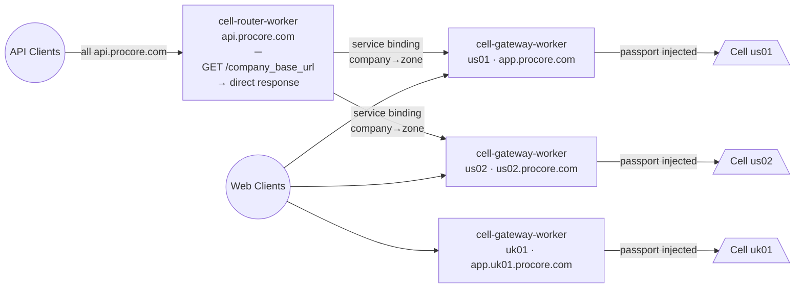
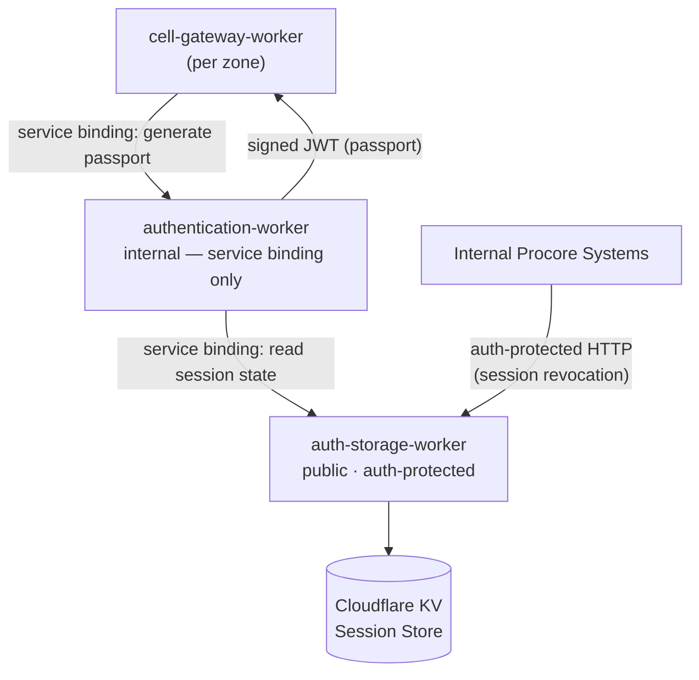
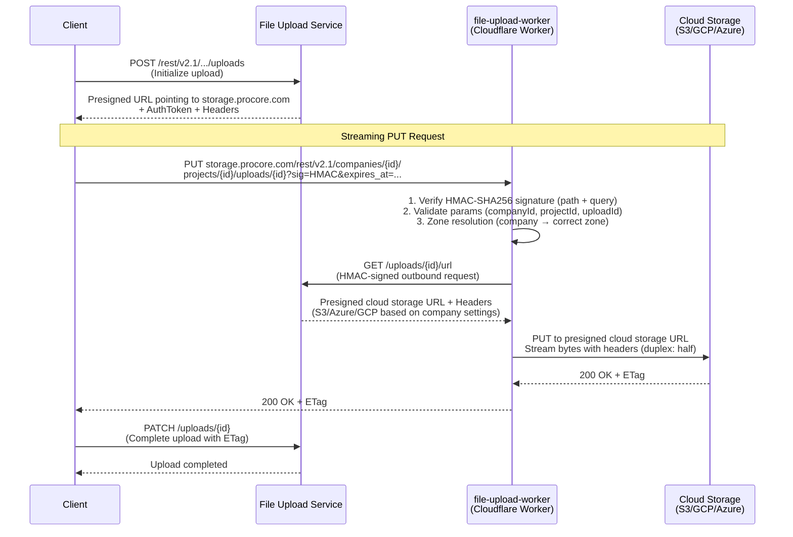

# Cloudflare Workers Demo -- Single Edge Ingress for Procore

A 5-10 minute demo covering Procore's Cloudflare Workers architecture: from the broad edge-ingress platform to the Files Worker innovation.

## Target Audience

Diverse engineering team. Most will benefit from understanding what CF Workers are and what they unlock; only a few teams need the file-upload deep-dive. Structure accordingly: broad platform story first, specific innovation second.

---

## Slide 0 -- Title / Hook (30 seconds)

**"Single Edge Ingress -- How Cloudflare Workers Power Procore"**

Open with the one-liner: *Every HTTP request to Procore now flows through code we own and can modify in < 200 lines of TypeScript, deployed globally in seconds.*

---

## Slide 1 -- The Before Picture (1 minute)

Paint the problem briefly:

- Traffic hit Procore infrastructure directly -- no programmable layer at the edge.
- Auth happened deep inside the stack (latency, duplication across services).
- Routing a customer to the right zone/cell required logic baked into backend services.
- File uploads went straight to origin servers, consuming bandwidth and exposing infra.
- Limited ability to react to attacks or shape traffic without code deploys.

---

## Slide 2 -- What is a Cloudflare Worker? (1 minute)

Keep this conceptual for the non-CF audience:

- Lightweight V8 isolates deployed to 300+ Cloudflare PoPs globally.
- Attaches to **any route** on a domain -- intercepts the HTTP request, can inspect/modify/respond/proxy.
- Cold start < 5 ms; no containers, no VMs.
- TypeScript/Hono stack; middleware chain just like Express/Koa.
- Deployed via Wrangler in seconds (no K8s rollout wait).

---

## Slide 3 -- Procore's Edge Architecture (2 minutes)

This is the core diagram. Show the full traffic flow:



Talk through the key workers:

1. **cell-router-worker** (`api.procore.com`) -- the front door. Extracts company ID, looks up zone, forwards via Cloudflare service binding (worker-to-worker, zero public-network hop).
2. **cell-gateway-worker** (per-zone: `app.procore.com`, `us02.procore.com`, `app.uk01.procore.com`) -- the last Cloudflare layer. Calls `authentication-worker` to mint a signed JWT passport and injects it into every request before it crosses the cloud boundary.
3. **authentication-worker** -- generates short-lived signed JWTs (passports). Not on any public route; reachable only via service binding. Reads session state from `auth-storage-worker` -> Cloudflare KV.
4. **pages-worker** -- serves SPAs on `/webclients/*`, applies CSP headers.

Key callout: **Auth at the Edge** -- authentication is done *before* the request ever reaches Procore infrastructure. This is a massive security and latency win.

### Authentication Stack



---

## Slide 4 -- What Else CF Gives Us for Free (1-2 minutes)

This is the "why should I care" section for the broader audience:

- **WAF (Web Application Firewall)** -- Cloudflare WAF sits in front of all workers. Rate limiting, bot management, DDoS mitigation, OWASP rulesets -- all at ingress before a single byte reaches Procore infra. Increases security posture without code changes.
- **Observability** -- OpenTelemetry tracing built into every worker via `tracing()` middleware. Traces exported to Honeycomb. Custom span attributes (`upload.company_id`, `upload.stream_to_cloud_storage_duration_ms`) give per-request visibility. Logpush enabled for all environments.
- **Quick turnaround** -- A code change deploys globally in seconds via Wrangler. Compare to a K8s service rollout. Feature flags via LaunchDarkly in KV allow instant toggles without any deploy.
- **Infrastructure protection** -- Procore origin servers are shielded. Attacks are absorbed at Cloudflare's 300+ PoPs. Session revocation happens at the edge (auth-storage-worker).
- **Programmable traffic shaping** -- Any route, any domain, any HTTP method. Inspect headers, rewrite paths, proxy to different backends, add headers, short-circuit with cached responses. The `ecrion-worker` is a live example: strangler-pattern migration done entirely at the edge.

---

## Slide 5 -- The Innovation: Files Worker (2-3 minutes)

Now zoom in on the specific innovation.

### Problem

- File uploads (S3, Azure, GCP) were flowing through Procore origin servers, consuming bandwidth and adding latency.
- Each cloud provider required different handling; this logic was scattered.

### Solution: `file-upload-worker` on `storage.procore.com`

#### Streaming Upload Flow



#### Key Technical Highlights

- **True streaming** -- file bytes flow *through* the Worker to storage. No buffering the full file. Uses `duplex: 'half'` streaming in the Fetch API.
- **Multi-cloud, single edge** -- the Worker doesn't care if the backend is S3, Azure, or GCP. It gets the presigned URL from FUS and streams there. The `storage.procore.com` domain is the single edge entry point for all customer file uploads globally.
- **HMAC integrity on both sides** -- inbound PUT is HMAC-verified (`URI_INTEGRITY_V2_1_PUT_DECRYPT`); outbound GET to FUS is HMAC-signed (`URI_INTEGRITY_V2_1_GET_ENCRYPT`). No credential leakage.
- **Zone-aware** -- uses `companyDetection()` + `zoneResolution()` middleware to route the FUS call to the correct zone, same as the rest of the edge layer.
- **Segmented uploads** -- supports multi-part uploads with `partNumber` routing.
- **Deployed everywhere** -- production route: `storage.procore.com/rest/v2.1/*`. Also staging, sandbox, monthly environments.
- **Full observability** -- custom span attributes: `upload.company_id`, `upload.upload_id`, `upload.is_standard`, `upload.fetch_cloud_storage_url_duration_ms`, `upload.stream_to_cloud_storage_duration_ms`.

#### The Entire Worker Setup (~15 lines)

```typescript
app
  .use(tracing({ isRoot: true }))
  .use(launchdarkly(config))
  .use(requestId)
  .use(companyDetection())
  .use(zoneResolution())
  .use(corsMiddleware)
  .get('/rest/v2.1/uploads/health', healthHandler)
  .put(
    '/rest/v2.1/companies/:companyId/projects/:projectId/uploads/:uploadId/parts/:partNumber',
    requireValidCompany,
    uploadHandler,
  )
  .put(
    '/rest/v2.1/companies/:companyId/projects/:projectId/uploads/:uploadId',
    requireValidCompany,
    uploadHandler,
  )
```

---

## Slide 6 -- Live Demo / Honeycomb Trace (1 minute, optional)

If time permits, show a real Honeycomb trace of a file upload:

- Root span tagged `external-edge` from the `tracing({ isRoot: true })` middleware.
- Child spans showing signature verification, FUS call duration, and storage stream duration.
- Span attributes showing company ID, upload ID, standard vs. segmented.

Alternatively, show a curl command hitting storage.procore.com and the resulting trace.

---

## Slide 7 -- Wrap-up / What This Unlocks (30 seconds)

- Any team can attach a Worker to any route -- it is a platform capability, not a one-off.
- Future possibilities: image optimization at edge, request coalescing, A/B testing, canary routing, geo-fencing, rate limiting per customer.
- The shared middleware stack (`tracing`, `requestId`, `launchdarkly`, `companyDetection`, `authentication`) means new workers start with observability, auth, and routing built in.

Close with: *We turned the edge from a black box into a programmable platform.*

---

## Timing Summary

| Section | Time |
|---------|------|
| Hook | 0:30 |
| Before picture | 1:00 |
| What is a CF Worker | 1:00 |
| Edge architecture | 2:00 |
| WAF / Observability / Security | 1:30 |
| Files Worker deep-dive | 2:30 |
| Live trace (optional) | 1:00 |
| Wrap-up | 0:30 |
| **Total** | **~8-10 min** |

---

## Presenter Notes

- For the diverse audience: spend more time on slides 2-4 (the platform story). This is what every team benefits from understanding.
- For the file-upload deep-dive: the mermaid sequence diagram from the SDR is a ready-made visual.
- Keep code snippets minimal on slides. The `app.ts` middleware chain (15 lines) is the best single snippet to show -- it demonstrates the entire worker setup.
- If asked about performance: CF Workers have < 5ms cold start, and streaming means no memory pressure from large files.
